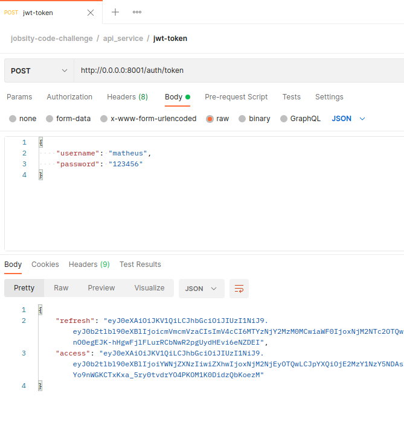

# Python/Django Challenge

Python/Django code challenge proposed by Jobsity.

## Architecture


1. A user makes a request asking for Apple's current Stock quote: `GET /stock?q=aapl.us`
2. The API service calls the stock service to retrieve the requested stock information
3. The stock service delegates the call to the external API, parses the response, and returns the information back to
   the API service.
4. The API service saves the response from the stock service in the database.
5. The data is formatted and returned to the user.

## Installation and deploy

### Docker and Docker Compose

Install Docker and Docker Compose following the official documentation (https://docs.docker.com/compose/install):

```shell
sudo curl -L "https://github.com/docker/compose/releases/download/1.29.2/docker-compose-$(uname -s)-$(uname -m)" -o /usr/local/bin/docker-compose
sudo chmod +x /usr/local/bin/docker-compose
sudo ln -s /usr/local/bin/docker-compose /usr/bin/docker-compose
docker-compose --version # test installation
```

### Django

Use Docker Compose to install both Django projects `api_service` and `stock_service`:

```shell
docker-compose build # build docker containers
docker-compose up    # run both services
```

This commands will create two different running containers:

```shell
sudo docker ps       # check if containers started successfully
```

```
CONTAINER ID   IMAGE                            COMMAND                  CREATED          STATUS          PORTS                                       NAMES
40bc3b6f6e8f   jobsity-django-challenge_api     "sh -c 'cd ./api_ser…"   45 minutes ago   Up 45 minutes   0.0.0.0:8001->8001/tcp, :::8001->8001/tcp   api
b48631b42498   jobsity-django-challenge_stock   "sh -c 'cd ./stock_s…"   45 minutes ago   Up 45 minutes   0.0.0.0:8000->8000/tcp, :::8000->8000/tcp   stock
```

Please make the sure ports `8000` and `8001` are not being used by another process. These ports will be used by:

- `http://0.0.0.0:8000`: internal API service `stock_service`
- `http://0.0.0.0:8001`: user-facing API service `api_service`.

Two SQLite databases will be created. The first one to store `api_service` requests. The second to store `stock_service`
unit tests.

## Authentication

Before requesting endpoints, please create a superuser and get an JWT token. All user-facing API endpoints have JWT
authentication.

### Create superuser

```shell
docker exec -it api python api_service/manage.py createsuperuser
```

### JWT Authentication credentials

To get your JWT Authentication credentials, please visit `https://0.0.0.0/auth/token`, and fill in the username and
password:


The `access` variable will return your JWT token.

### CRUD pages

You can also create a user (not superuser) with `https://0.0.0.0/register` (page created for easier authentication and
testing not superuser endpoints).


Visit the login page at `https://0.0.0.0/login`:


### Request using Postman

To request endpoints using Postman, download the app at `https://www.postman.com/downloads` and
export the `postman/jobsity-code-challenge.postman_collection.json` collection.


To authenticate using Postman, paste your JWT token in `Authorization` > Type `Bearer Token` > `Token`.


## Endpoints

### API service

- `http://0.0.0.0:8001/auth/token` or `POST /auth/token`

Payload

  ```
    {
      "username": "matheus",
      "password": "123456"
    }
  ```

Response

  ```
    {
        "refresh": "eyJ0eXAiOiJKV1QiLCJhbGciOiJIUzI1NiJ9.eyJ0b2tlbl90eXBlIjoicmVmcmVzaCIsImV4cCI6MTYzNjY1Nzc3OCwia...
        "access": "eyJ0eXAiOiJKV1QiLCJhbGciOiJIUzI1NiJ9.eyJ0b2tlbl90eXBlIjoiYWNjZXNzIiwiZXhwIjoxNjM2NjA3Mzc4LCJpYX...
    }  
```



- `http://0.0.0.0:8001/stock?q=aapl.us` or `GET /stock?q=aapl.us`

Response

  ```
    {
    "name": "APPLE",
    "symbol": "AAPL.US",
    "open": 123.66,
    "high": 123.66,
    "low": 122.49,
    "close": 123
    }
  ```


- `http://0.0.0.0:8001/history` or `GET /history`

Response

  ```
  [
      {"date": "2021-04-01T19:20:30Z", "name": "APPLE", "symbol": "AAPL.US", "open": "123.66", "high": 123.66, "low": 122.49, "close": "123"},
      {"date": "2021-03-25T11:10:55Z", "name": "APPLE", "symbol": "AAPL.US", "open": "121.10", "high": 123.66, "low": 122, "close": "122"},
      ...
  ]
  ```


- `http://0.0.0.0:8001/stats` or `GET /stats`

Response

  ```
  [
      {"stock": "aapl.us", "times_requested": 5},
      {"stock": "msft.us", "times_requested": 2},
      ...
  ]
  ```


### Stock service

`http://0.0.0.0:8000/stock?q=aapl.us` or `GET /stock?q=aapl.us`

Response

  ```
    {
    "name": "APPLE",
    "symbol": "AAPL.US",
    "open": 123.66,
    "high": 123.66,
    "low": 122.49,
    "close": 123
    }
  ```


## Tests

### API service

To run tests with Docker in the API service:

```shell
docker exec -it api python api_service/manage.py test api
```

`api_service` has seven different unit tests, all passing:

```
.......
----------------------------------------------------------------------
Ran 7 tests in 5.051s

OK
```

### Stock service

To run tests with Docker in the Stock service:

```shell
docker exec -it stock python stock_service/manage.py test stock_service
```

`stock_service` has three different unit tests, all passing:

```
...
----------------------------------------------------------------------
Ran 3 tests in 2.243s

OK
```

## Requirements

All required features were finished.

### API service

:heavy_check_mark: Endpoints in the API service should require authentication (no anonymous requests should be allowed).
Each request should be authenticated via Basic Authentication. \
:heavy_check_mark: When a user makes a request to get a stock quote (calls the stock endpoint in the api service), if a
stock is found, it should be saved in the database associated to the user making the request. \
:heavy_check_mark: A user can get his history of queries made to the api service by hitting the history endpoint. The
endpoint should return the list of entries saved in the database, showing the latest entries first. \
:heavy_check_mark: A super user (and only super users) can hit the stats endpoint, which will return the top 5 most
requested stocks. \
:heavy_check_mark: All endpoint responses should be in JSON format.

### Stock service

:heavy_check_mark: Endpoints in this service don't need to be authenticated. \
:heavy_check_mark: When a stock request is received, this service should query an external API to get the stock
information. For this challege, use this API: `​https://stooq.com/q/l/?s={stock_code}&f=sd2t2ohlcvn&h&e=csv​`.

### Bonuses

Finished bonuses features:

:heavy_check_mark: Add unit tests for the bot and the main app. \
:heavy_check_mark: Use JWT instead of basic authentication for endpoints.

Also, not requested:

:heavy_check_mark: CRUD created using Django to easier user authentication. \
:heavy_check_mark: Project created with Docker for easier project setup and deploy. \
:heavy_check_mark: Endpoints documented using Postman.
